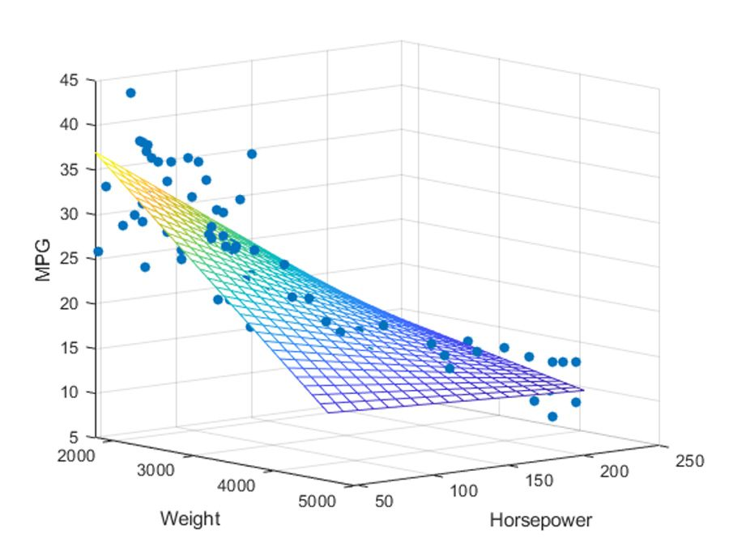
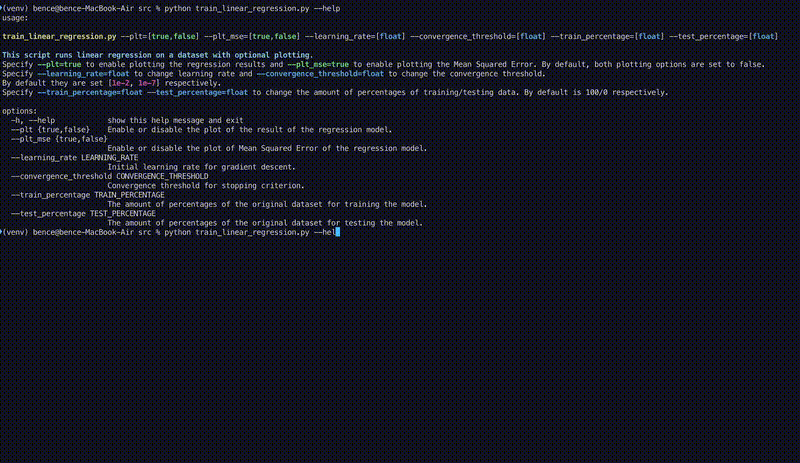
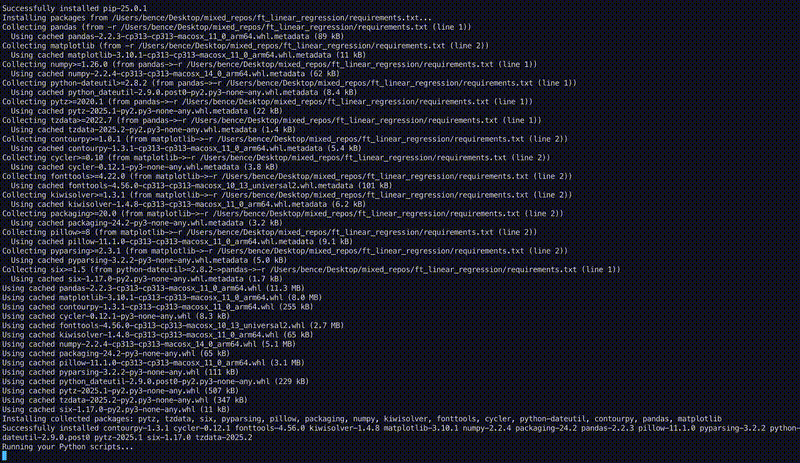

# Linear Regression Project

<!-- Improved compatibility of back to top link: See: https://github.com/othneildrew/Best-README-Template/pull/73 -->
<a id="readme-top"></a>

<br />
<div align="center">
  <!-- If you have a logo or banner, you can include it here
  <a href="https://github.com/alexdrumi/ft_linear_regression">
    
  </a>
  -->

  <h3 align="center">Linear Regression Project</h3>
  <p align="center">
    <strong>Basic Machine Learning with Gradient Descent</strong>
  </p>

  <p align="center">
    A hands-on introduction to the fundamental concepts of <em>Machine Learning</em> by creating a 
    linear regression model that predicts car prices based on mileage.
  </p>
</div>

## Objective
The aim of this project is to introduce you to the basic concept behind machine learning. For this project, you will have to create a program that predicts the price of a car by using a linear function trained with a gradient descent algorithm. We will work on a precise example for the project, but once you’re done, you will be able to use the algorithm with any other dataset.

## About The Project
In this repository, you'll find a straightforward yet powerful toolkit for **predicting used car prices** based on provided mileage data. The core of the project is a **customizable training process** that allows you to tweak parameters such as learning rate, convergence threshold, and data-splitting ratios. 
<p align="right">(<a href="#readme-top">back to top</a>)</p>

## Project Structure
- **data/**: Contains the main dataset (`data.csv`), split training and testing data, and the trained parameters (`thetas.txt`).
- **src/**: Contains all Python scripts for parsing command-line arguments, data processing, error handling, implementing the regression, and plotting.
- **README.md**: This documentation.
  

<!-- GETTING STARTED -->
## Getting Started

Follow these instructions to set up the project locally.

1. **Clone the repository:**
   ```bash
   git clone git@github.com:alexdrumi/ft_linear_regression.git
   cd ft_linear_regression

2. **Run training then predicting in one call:**
   ```bash
   source ./run_all.sh

3. **Train with custom paremeters:**
   ```bash
   python src/train.py --plt=true --plt_mse=true --learning_rate=0.01 --convergence_threshold=0.0000001 --train_percentage=80 --test_percentage=20

4. **Predict:**
   ```bash
   python src/predict.py


## Media

This project includes demo GIFs and screenshots to showcase its functionality. All media files are stored in the `assets` folder.

**Demo GIFs:**

- **Training Process:**  
  

- **Prediction Process:**  
  


